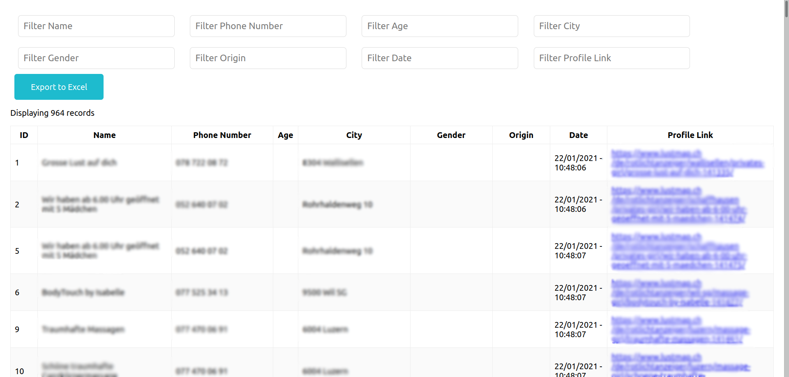

# Frontend for "End Demand Switzerland" Scraping project

This repository contains the code to display the data scraped using Python (for confidentiality reasons, that repository is private). The user has the possibility to filter/sort rows and export the selection to an Excel file.

## Available Scripts

In the project directory, you can run:

### `npm start`

Runs the app in the development mode. 
Open [http://localhost:3000](http://localhost:3000) to view it in the browser.

### `npm test`

Launches the test runner in the interactive watch mode. 

### `npm build`

Builds the app for production to the `build` folder. 
It correctly bundles React in production mode and optimizes the build for the best performance.
